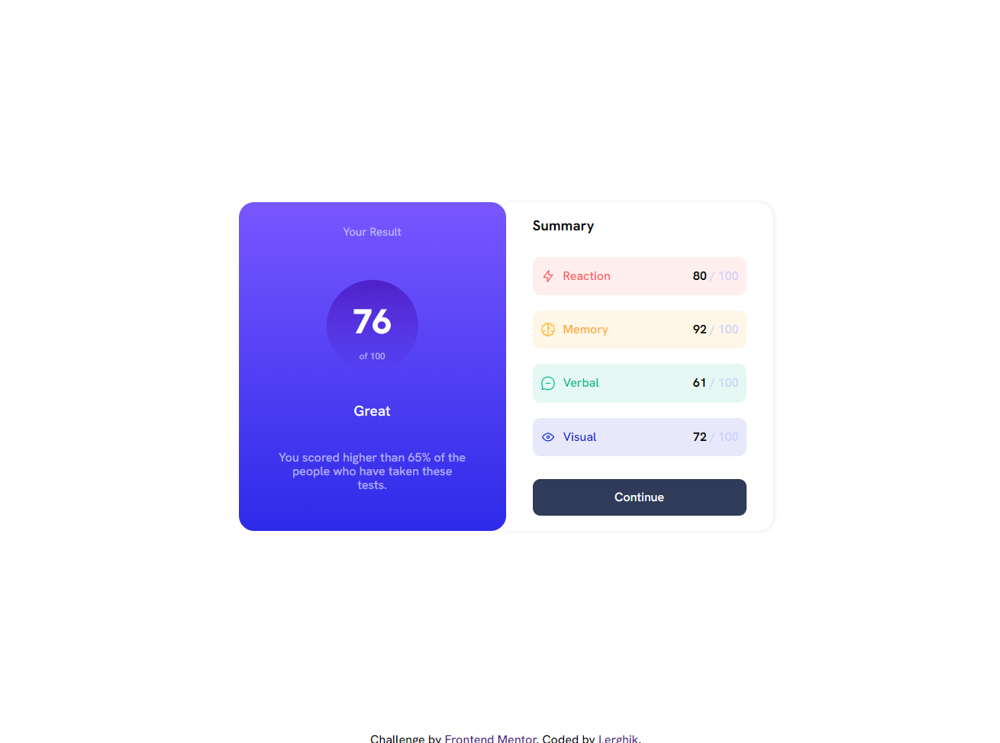

# Frontend Mentor - Results summary component solution

This is a solution to the [Results summary component challenge on Frontend Mentor](https://www.frontendmentor.io/challenges/results-summary-component-CE_K6s0maV). Frontend Mentor challenges help you improve your coding skills by building realistic projects. 

## Table of contents

- [Overview](#overview)
  - [The challenge](#the-challenge)
  - [Screenshot](#screenshot)
  - [Links](#links)
- [My process](#my-process)
  - [Built with](#built-with)
  - [What I learned](#what-i-learned)
  - [Continued development](#continued-development)
- [Author](#author)

**Note: Delete this note and update the table of contents based on what sections you keep.**

## Overview

### The challenge

Users should be able to:

- View the optimal layout for the interface depending on their device's screen size
- See hover and focus states for all interactive elements on the page

### Screenshot

### Links

- Solution URL: https://www.frontendmentor.io/solutions/first-challenge-after-learning-the-basics-pjz_1-a2LB
- Live Site URL: https://lerghik.github.io/fisrt-basics-solution/

## My process

### Built with

Basics of:

-HTML
-CSS
-CSS Flex and Grid

### What I learned
-I learnt how to define and use variables with the use of :root pseudo-class

-How to add more than one style to the font imported from google fonts

-The basics of the :nth-child() pseudo-class

### Continued development

Improve my skills with HTML and CSS and start learning good practices so my code is more readable and maintainable.
Indtroduce little by little more complex aspects of these languages.

## Author

- Frontend Mentor - https://www.frontendmentor.io/profile/Lerghik
